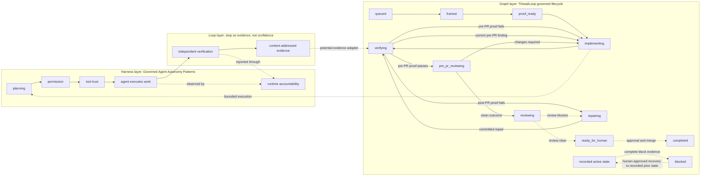

# ThreadLoop

ThreadLoop is a local-first CLI that models an AI-assisted software-delivery task as a governed lifecycle graph. It
stores lifecycle state in repo-local SQLite, returns a deterministic next-action candidate, validates explicit
transition requests against current policy and evidence, and renders review artifacts under `.threadloop/artifacts/`.

Agents can execute work, but policy and evidence determine which lifecycle transition is allowed next. A caller must
request each transition; ThreadLoop applies it idempotently only when its structural, repository, proof, repair-budget,
and recovery requirements are satisfied.

ThreadLoop is for repository maintainers and developer-tooling teams that run AI-assisted coding work and need lifecycle
advancement to remain explicit, inspectable, and evidence-bound.

For the orchestrated v2 workflow, see [docs/agent-mode.md](docs/agent-mode.md).

## Three layers: harness, loop, graph

An agent system that touches production separates three concerns that are easy to conflate:

- **Harness engineering** builds the environment the model operates in: context, action surfaces, permission,
  persistence, and observability.
- **Loop engineering** designs the work-and-feedback cycle, and above all its stop rule.
- **Graph engineering** makes topology explicit: which step is allowed to happen next, and on whose authority.

ThreadLoop is the graph layer plus the outer loop's stop rule. It encodes lifecycle states as nodes, permitted
transitions as edges, and repository, proof, review, and repair-budget requirements as transition guards. Verification,
bounded repair, re-entry, blocking, and recovery are explicit parts of that graph rather than ad hoc retry logic.

The "loop" in ThreadLoop is the outer verify -> repair -> re-enter cycle whose stop condition is a guard decision. It is
not the inner tool-use loop of an agent turn.



The solid lifecycle edges are executable when their guards pass. Pre-PR implementation may repeat for as many
task-scoped commits as necessary; every commit makes earlier proof and review evidence stale. Those iterations never
enter `repairing` or consume its budget. Entering `reviewing` closes the pre-PR phase permanently. The dashed post-PR
review-owned edges remain fail-closed until ThreadLoop has authoritative signed review, approval, and merge evidence.
The post-PR repair loop is limited to three entries. Entering `blocked` requires complete block evidence, and recovery
requires explicit human approval to return to the recorded prior state.

### Node boundaries are authority boundaries

The lifecycle graph is not a diagram of imagined workflow steps. Each node exists because the right to advance changes
hands there, which is why the topology is knowable before any work runs:

| Boundary                        | Authority that must act                                      |
| ------------------------------- | ------------------------------------------------------------ |
| `implementing -> verifying`     | The agent, by producing one clean descendant commit          |
| `verifying -> pre_pr_reviewing` | Local gates and independently signed CI, at the current HEAD |
| `pre_pr_reviewing -> reviewing` | A reviewer, by recording a current-HEAD clean outcome        |
| `reviewing -> ready_for_human`  | Verified signed-review evidence without blockers             |
| `ready_for_human -> completed`  | A human `User` approval plus an observed merge at that HEAD  |
| any active state `-> blocked`   | Complete block evidence, with human-approved recovery only   |

What is deliberately not fixed in advance is iteration count. The number of implement/verify/review cycles is unbounded
before the PR boundary; only the post-PR repair budget is capped.

### Evidence must be current, not merely present

A stop rule that accepts "the tests passed" accepts a stale claim. ThreadLoop binds every guard to an exact commit:
receipts record stdout, stderr, and output-artifact digests, signed CI and review packages are verified against an
immutable policy, and any new commit stales earlier local, signed-CI, pre-PR review, and signed-review evidence unless
the evidence contract binds the new HEAD. Guard decisions and applied transitions land in a hash-linked, append-only
audit ledger with a verified no-overwrite export.

### Harness engineering is an explicit non-goal

ThreadLoop supplies no tools, no context injection, no model routing, and no permission enforcement. It consumes a
harness instead of being one, and refuses to advance when that harness cannot produce current evidence. Two harness
concerns are hardened as a byproduct: persistence, through repo-local SQLite, append-only receipts, and the audit
ledger; and observability, through verified JSONL export documented in [docs/observability.md](docs/observability.md). A
gate whose provisioning fails is reported as a distinct `setup_failed` result precisely so a harness problem cannot
consume loop-layer repair budget.

[Governed Agent Autonomy Patterns](https://github.com/nnennandukwe/governed-agent-autonomy-patterns) defines the
harness-layer controls around an agent run: planning, permission, tool trust, independent verification, and runtime
accountability. Four of those five are harness concerns. Independent verification is the seam where a harness produces
the evidence a graph can consume, which is where the two projects meet. This is an architectural relationship, not a
runtime dependency: ThreadLoop does not currently ingest BoundaryBench receipts.

### Primary interfaces and outputs

| Interface                                          | Output or state change                                              |
| -------------------------------------------------- | ------------------------------------------------------------------- |
| `threadloop session next --session <id> --json`    | A read-only transition candidate, guard failures, and required work |
| `threadloop session transition <target-state> ...` | An idempotent transition or a structured guard rejection            |
| `threadloop session gate run <gate-id> ...`        | A current-HEAD gate receipt and digest-bound output artifact        |
| `threadloop artifact generate <kind> ...`          | A Markdown change brief, PR summary, or handoff artifact            |
| `.threadloop/state/state.db`                       | Canonical repo-local lifecycle, transition, plan, and receipt state |

## Current command surfaces

Canonical session contract:

- `threadloop session start <title> --goal <goal> [--json]`
- `threadloop session list [--json]`
- `threadloop session status --session <id> [--json]`
- `threadloop session capture <kind> [text] --session <id> [--json]`
- `threadloop session heartbeat --session <id> [--json]`
- `threadloop session reconcile --session <id>|--all [--json]`
- `threadloop session next --session <id> [--json]`
- `threadloop session transition <target-state> --session <id> --expected-state-version <version> --idempotency-key <key> --actor <cli|agent> --input <json-object> [--json]`
- `threadloop session gate run <gate-id> --session <id> [--json]`
- `threadloop session gate import <package-path> --session <id> [--json]`
- `threadloop session review import <package-path> --session <id> [--json]`
- `threadloop audit show --session <id> [--json]`
- `threadloop audit verify --session <id> [--root <sha256>] [--json]`
- `threadloop audit export --session <id> --output <path> [--json]`

Compatibility surface:

- `threadloop init`
- `threadloop start <title> [--json]`
- `threadloop capture <kind> [text] [--session <id>] [--json]`
- `threadloop status [--session <id>] [--json]`
- `threadloop artifact generate [change-brief|pr-summary|handoff] [--session <id>] [--json]`

Compatibility rule:

- legacy `capture` and `artifact generate` auto-resolve only when exactly one active session exists
- legacy `start` preserves the legacy single-active-session behavior and refuses to open a second legacy root session in
  the same repo
- legacy `status` fails with `SESSION_REQUIRED` when zero sessions match
- when zero sessions match for `capture` and `artifact generate`, they fail with `SESSION_REQUIRED`
- when multiple sessions match for any legacy command, they fail with `SESSION_AMBIGUOUS`
- pass `--session <id>` or use `threadloop session ...` for deterministic targeting

Implemented storage:

- `.threadloop/config.json`
- `.threadloop/state/state.db`
- `.threadloop/artifacts/*.md`
- `.threadloop/artifacts/receipts/<session-id>/<receipt-id>/`

Legacy repos with `.threadloop/state/state.json` migrate into SQLite on first init/read/write. The JSON file is
intentionally left in place as a safety backup during this phase, but ThreadLoop reads from SQLite after migration.

## Install

Prerequisites:

- Node 22.13.0 or newer
- a Git repository

```bash
npm install
npm run build
```

## Try it in another repo

ThreadLoop supports two local install flows right now.

### 1. `npm link` for fast local iteration

In the ThreadLoop repo:

```bash
npm link
```

In another Git repo:

```bash
threadloop session start "Add retry logic" --goal "Reduce transient failures" --actor agent --json
session_id="session_123" # replace with the session_id returned from session start
threadloop session capture decision "Retry only idempotent jobs" --session "$session_id" --because "Replay must stay safe" --actor agent
threadloop session status --session "$session_id" --json
```

Use this path for day-to-day local development. It does not require adding ThreadLoop to the consumer repo's
dependencies.

### 2. `npm pack` for install verification

In the ThreadLoop repo:

```bash
npm pack
```

Then in another Git repo, install the generated tarball:

```bash
npm install /absolute/path/to/threadloop-0.1.0.tgz
npx threadloop session start "Add retry logic" --goal "Reduce transient failures" --json
```

Use this path to verify packaging and distribution behavior.

You can also run the automated smoke check from the ThreadLoop repo:

```bash
npm run smoke:pack
```

### What `threadloop init` does

- creates `.threadloop/` if needed
- creates or opens `.threadloop/state/state.db`
- migrates legacy `.threadloop/state/state.json` into SQLite when present
- ensures `.threadloop/state/` and `.threadloop/artifacts/receipts/` are ignored via `.git/info/exclude`
- leaves normal `.threadloop/artifacts/*.md` review artifacts visible

## SQLite migration status

The current SQLite work is the storage foundation for ThreadLoop v2 autonomous agent mode.

What is implemented now:

- SQLite-backed durable state
- transactional writes for core mutations
- migration from legacy `state.json`
- explicit `session` namespace commands
- compatibility wrappers that safely fail on ambiguous multi-session state
- `--json` machine-output contract for session commands and legacy wrappers
- reconcile and snapshot persistence
- daemon-driven mechanical refresh
- deterministic, idempotent lifecycle transitions with optimistic state versions
- immutable proof plans bound to a clean branch and baseline commit
- shell-free execution of declared local gates with digest-bound, append-only receipts
- current-HEAD staleness, artifact-integrity checks, and a transition-history-derived three-repair budget
- signed current-HEAD review evidence for blockers, same-HEAD human approval, and merge observation
- a shared three-cycle gate/review repair budget
- repeatable pre-PR implementation with a durable `pre_pr_reviewing` boundary and HEAD-bound review evidence
- history-derived `pre_pr`/`post_pr` phase separation so pre-PR iteration never consumes signed-review repair budget
- a hash-linked, append-only controller audit ledger with verified no-overwrite JSONL export
- a read-only next-action v4 contract with lifecycle phase, implementation basis, pre-PR review, proof, signed review,
  audit, and next-human-action projections
- protocol v4 and governed handoff v3

What is not implemented yet in this slice:

- same-checkout autonomous multi-task concurrency hardening

## Quick start

```bash
npx threadloop session start "Add retry logic to job runner" --goal "Reduce transient failure rate" --base main --actor agent --json
session_id="session_123" # replace with the session_id returned from session start
npx threadloop session capture decision "Retry only idempotent jobs" --session "$session_id" --because "Non-idempotent replay is unsafe" --actor agent
npx threadloop session capture validation "Ran targeted tests for retry backoff and cancellation" --session "$session_id"
npx threadloop session next --session "$session_id" --json
npx threadloop session transition framed --session "$session_id" --expected-state-version 0 --idempotency-key "quickstart:$session_id:0" --actor agent --input '{}' --json
npx threadloop session status --session "$session_id" --json
npx threadloop protocol --json
npx threadloop artifact generate change-brief --session "$session_id"
```

## Autonomous agent mode

Use explicit session commands for automation and keep one autonomous task per checkout or Git worktree.

Recommended loop:

1. fetch `origin` and fast-forward local `main` to `origin/main`
2. create a fresh task branch from updated `main`
3. `threadloop session start ... --base main --actor agent --json`
4. persist the returned `session_id`
5. `threadloop session capture ... --session "$session_id" --actor agent`
6. `threadloop session reconcile --session "$session_id"` when Git-derived scope needs refresh
7. rebase the task branch onto the latest `origin/main`
8. `threadloop artifact generate pr-summary --session "$session_id"`
9. record the exact proof plan during `framed -> proof_ready`
10. call `session gate run <gate-id>` for each declared gate while verifying
11. import each matching receipt from the commit-pinned reusable GitHub workflow
12. call `session next --json`; failed pre-PR proof returns to `implementing` without repair-budget use
13. after proof passes, enter `pre_pr_reviewing` and explicitly record a current-HEAD clean or changes-required pre-PR
    review outcome
14. repeat implementation, proof, and pre-PR review wakes until a clean outcome closes the phase at `reviewing`
15. after PR creation, import current signed review snapshots and follow their bounded repair, approval, and merge
    projections
16. verify and export the audit ledger for handoff or telemetry

Use `threadloop protocol --json` as the machine-facing contract for current commands, entry kinds, artifact kinds,
supported environment variables, and the published branch/rebase/PR workflow guidance.

The optional daemon only performs mechanical refresh work. It does not create semantic notes or replace explicit
capture.

The governed task lifecycle and schema-v8 contract are documented in [`docs/lifecycle.md`](docs/lifecycle.md). The
signed package and reusable workflow are specified in
[`docs/attestations/receipt-v2.md`](docs/attestations/receipt-v2.md) and
[`docs/attestations/review-v1.md`](docs/attestations/review-v1.md). `session transition` revalidates local, CI, and
review evidence and records every unique guard decision in the audit ledger.

## Longer notes with `$EDITOR`

For longer capture text, use your editor:

```bash
export EDITOR="vim"
session_id="session_123" # replace with the session_id returned from session start
npx threadloop session capture note --edit --session "$session_id"
npx threadloop session start "Reshape queue workers" --goal-edit --json
```

## Entry kinds

Supported entry kinds:

- `intent`
- `note`
- `decision`
- `risk`
- `constraint`
- `validation`
- `reviewer_guidance`

## Artifact kinds

- `change-brief`: full review-ready artifact
- `pr-summary`: thinner PR-oriented view
- `handoff`: current-state handoff note

Example artifacts live in `examples/`.

## Development

```bash
npm ci
npm run check
npm run security:dependencies
```

`npm run check` is the canonical deterministic quality gate. It covers formatting, source and Markdown linting,
repository-wide type checking, dead-code analysis, community-file validation, tests, the production build, and packaged
installation. See the [contribution guide](CONTRIBUTING.md) for hook behavior and security-check details.

## Notes

- ThreadLoop requires a Git repository.
- Prefer `threadloop session ...` commands for explicit session work.
- Compatibility root `start` keeps one active session per repo.
- Compatibility root `capture` and `artifact generate` work without `--session` only when exactly one active session
  exists.
- Compatibility root `status` fails with `SESSION_REQUIRED` when zero sessions match.
- `.threadloop/state/` is ignored via `.git/info/exclude` by default.
- `.threadloop/artifacts/receipts/` is ignored locally; normal review artifacts are not hidden.
- Artifacts are local by default and may be committed when useful.

## Docs

- [CLI reference](docs/cli.md)
- [Consumer onboarding](docs/consumer-onboarding.md)
- [Autonomous agent mode](docs/agent-mode.md)
- [Governed lifecycle](docs/lifecycle.md)
- [Audit export and OpenTelemetry](docs/observability.md)
- [Contribution guide](CONTRIBUTING.md)

## License

Licensed under the [Apache License, Version 2.0](LICENSE). See [NOTICE](NOTICE) for attribution.
