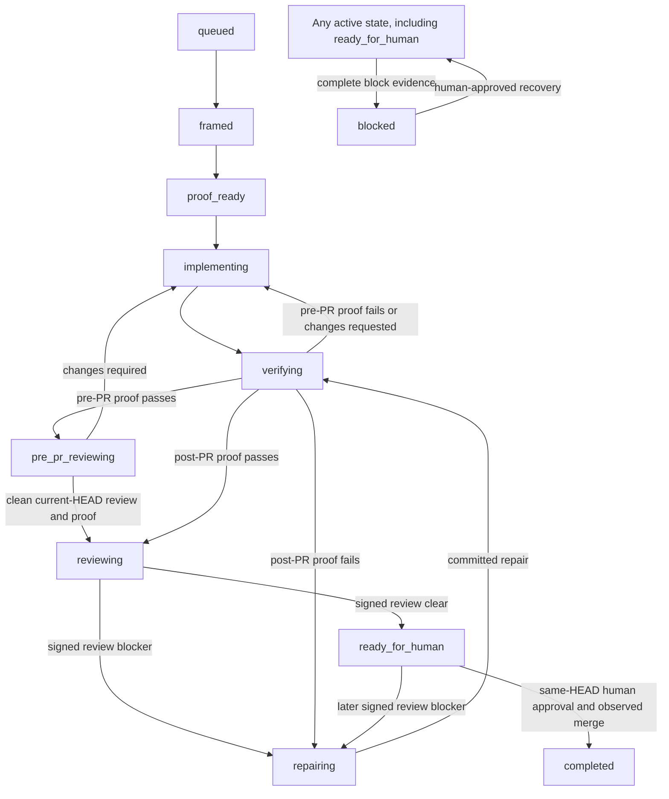
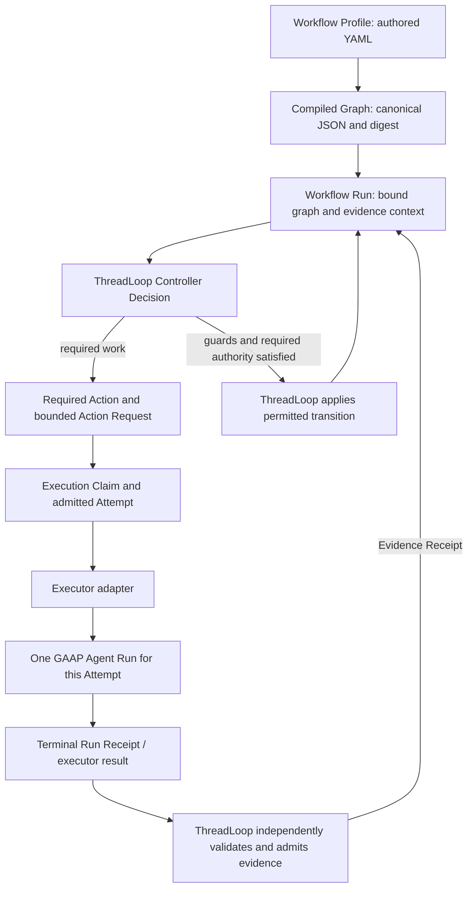

# ThreadLoop architecture and Controller Contract v0.1

ThreadLoop owns the outer software development lifecycle (SDLC) for a bounded software-delivery change. It stores state
and evidence, evaluates guards, and applies explicitly requested transitions. The current TypeScript/Node CLI implements
a fixed governed PR lifecycle. Controller Contract v0.1 specifies how that authority extends to configurable typed SDLC
graphs and bounded external execution.

Use the [README quickstart](../README.md#quick-start) to run the current CLI. Use this guide to understand the accepted
contracts and what remains to be implemented. The [glossary](../CONTEXT.md) defines the public language; the
[authority-model ADR](adr/0001-sdlc-graph-authority-model.md) records the accepted ownership boundaries.

## Capability status

The status applies to the specific capability, not to every use of the same domain term.

| Status                                           | Capability                                                                                                                                                         | Evidence or next owner                                                                                                                                                                                                                                                    |
| ------------------------------------------------ | ------------------------------------------------------------------------------------------------------------------------------------------------------------------ | ------------------------------------------------------------------------------------------------------------------------------------------------------------------------------------------------------------------------------------------------------------------------- |
| **Implemented now**                              | Fixed PR lifecycle, SQLite persistence, guarded transitions, current-HEAD proof/review checks, repair accounting, blocking, and human completion.                  | [Lifecycle reference](lifecycle.md) and [preservation mapping](current-lifecycle-graph-mapping.md).                                                                                                                                                                       |
| **Implemented now**                              | Session CLI, read-only next-action inspection, Markdown artifacts, and verified audit exports.                                                                     | [CLI reference](cli.md) and [audit export](observability.md).                                                                                                                                                                                                             |
| **Implemented now**                              | Source-tree YAML compiler, candidate validators, executor mapping helpers, and internal conformance-corpus checks.                                                 | Development tooling documented in the [contract index](#contract-index); it is not a configurable runtime.                                                                                                                                                                |
| **Accepted in Controller Contract v0.1**         | Profile/graph identities, deterministic decisions and action requests, claim/attempt recovery semantics, executor process seam, and external conformance protocol. | Five versioned contract families in the [contract index](#contract-index).                                                                                                                                                                                                |
| **Deferred to the controller-runtime milestone** | Configurable graph selection/execution, durable graph-bound runs and Execution Claims, and conformance by a real controller through the external harness.          | [Contract tracker #110](https://github.com/nnennandukwe/threadloop/issues/110), [conformance handoff](contracts/controller-conformance-v0.1/run-invariant-follow-up.md), and [generated state-machine tests #112](https://github.com/nnennandukwe/threadloop/issues/112). |
| **Deferred to the controller-runtime milestone** | GAAP process invocation, independently authenticated receipt admission, and persistence before controller reevaluation.                                            | [Runtime integration #111](https://github.com/nnennandukwe/threadloop/issues/111).                                                                                                                                                                                        |
| **Deferred to the Rust migration**               | A Rust replacement of ThreadLoop after the contract freeze and the separate runtime milestone prove the required behavior.                                         | [Tracker #110](https://github.com/nnennandukwe/threadloop/issues/110); [storage evolution #85](https://github.com/nnennandukwe/threadloop/issues/85) remains a migration prerequisite.                                                                                    |

An accepted schema is not a running service. A valid fixture is not an admitted receipt, an acquired claim, or a runtime
conformance result. Existing CLI `task` and `session` names remain compatibility terms; these contracts do not rename
commands, change SQLite records, or retroactively bind sessions to configurable graphs.

## Four roles and their authority

| Role                                     | Responsibility                                                                                                                        | Authority boundary                                                                                                         |
| ---------------------------------------- | ------------------------------------------------------------------------------------------------------------------------------------- | -------------------------------------------------------------------------------------------------------------------------- |
| **ThreadLoop**                           | Own the Workflow Run, outer SDLC feedback loop, guarded transitions, evidence freshness, repair rules, and human completion boundary. | Only ThreadLoop applies its lifecycle decisions. Claims and configurable graph evaluation remain deferred as listed above. |
| **GAAP**                                 | Govern one bounded Agent Run, including its model/tool work and protected effects.                                                    | Completion of an Agent Run supplies evidence; it cannot complete a ThreadLoop Workflow Run.                                |
| **RunInvariant**                         | Evaluate implementation-independent decision conformance through fixtures and a process interface.                                    | Conformance output cannot dispatch work or advance lifecycle state.                                                        |
| **Adapters and delivery infrastructure** | Execute bounded requests, translate provider observations, or deliver scheduler wakes.                                                | Delivery, process success, and adapter output cannot invent authorization, recover blocked runs, or approve completion.    |

[Governed Agent Autonomy Patterns (GAAP)](https://github.com/nnennandukwe/governed-agent-autonomy-patterns) is an inner
execution system. ThreadLoop is the outer lifecycle authority; it is neither an agent harness nor a general-purpose DAG
engine. Its graph language has registered SDLC actions, guards, authority requirements, and cycle controls, rather than
arbitrary executable nodes or expressions.

[RunInvariant](https://github.com/nnennandukwe/run-invariant) currently provides GAAP decision-conformance
infrastructure. [RunInvariant PR #4](https://github.com/nnennandukwe/run-invariant/pull/4) merged a separate ThreadLoop
controller harness that consumes this repository's pinned corpus, launches one external process per case, and validates
responses. Synthetic subjects exercise the harness; a real ThreadLoop controller has not demonstrated conformance. The
corpus stays in ThreadLoop. The [integration handoff](contracts/controller-conformance-v0.1/run-invariant-follow-up.md)
records the requirements and remaining proof. Merged harness support does not establish a release or runtime
integration.

## Implemented now: the fixed governed PR lifecycle

Every arrow below is conditional on the corresponding guards. ThreadLoop requires callers to request transitions;
`session next` only reports a candidate and missing work.



The `Any active state` box summarizes block/recovery edges; it is not a twelfth lifecycle state. Recovery returns only
to the recorded prior state, and `completed` is terminal.

Pre-PR implementation, verification, and review can repeat without consuming the post-PR repair budget. Entering
`reviewing` permanently closes that phase. Post-PR repair permits at most three entries; the third repair may finish its
verification, but a fourth entry is denied. A provisioning failure produces `setup_failed` and requires setup
correction, not a code-repair entry. Blocking still requires explicit evidence; budget exhaustion cannot invent it.

A new commit makes earlier proof and review stale unless their evidence contract binds the new HEAD. Signed CI and
review imports are implemented current-runtime capabilities; they are separate from the deferred GAAP receipt importer.
See the [lifecycle reference](lifecycle.md) for exact guards, rejection behavior, and transactional replay rules.

## Accepted in Controller Contract v0.1: the execution relationship

The following diagram describes accepted responsibilities. Configurable runtime execution of this flow is **deferred to
the controller-runtime milestone**. It is not a diagram of an existing ThreadLoop-to-GAAP integration.



RunInvariant sits outside this runtime path: it tests a subject implementation against the separate corpus. Schedulers
only deliver work; human actions remain human handoffs rather than requests that the GAAP adapter may execute.

The conceptual walkthrough is:

| Term                    | What the developer needs to understand                                                                           |
| ----------------------- | ---------------------------------------------------------------------------------------------------------------- |
| **Workflow Profile**    | Author the typed SDLC states, transitions, guards, and Required Actions for a class of work.                     |
| **Compiled Graph**      | Validate and normalize that profile into a deterministic, content-addressed graph.                               |
| **Workflow Run**        | Retain one durable change's state and evidence context, bound to the exact graph identity.                       |
| **Required Action**     | Identify external work needed before a guard can pass. Declaring it does not satisfy the guard.                  |
| **Action Request**      | Bind exactly one bounded action to a run, state, subject, inputs, constraints, and required authority.           |
| **Execution Claim**     | Exclusively authorize one executor incarnation for an exact request within a time bound and fencing generation.  |
| **Attempt**             | Record one admitted execution under that claim generation, with outcome distinct from workflow completion.       |
| **Evidence Receipt**    | Retain observed work or verification for independent admission and guard evaluation.                             |
| **Controller Decision** | Evaluate explicit inputs and determine the permitted outcome, further work, waiting, blocking, or human handoff. |

This ordering explains the terms; it is not an unconditional pipeline. Controller Decisions also select work before an
Attempt and reevaluate after evidence arrives. Candidate validators check consistency; they do not implement the
complete selector or grant live authorization.

### Workflow Run versus Agent Run

A Workflow Run can require multiple bounded actions and Attempts across implementation, verification, and repair. For
the selected GAAP adapter, **one ThreadLoop Attempt maps to one GAAP Agent Run**. The adapter retains the outer
ThreadLoop bindings while mapping the inner request to GAAP's vocabulary through the canonical JSON process seam. There
is no shared Rust-type dependency.

The accepted executor protocol is one-shot: one request, one terminal result. An authority-required outcome ends that
Attempt as blocked; it cannot silently resume the old terminal Agent Run. GAAP success, a zero process exit, and a
well-formed receipt are each insufficient for lifecycle advancement. The future host must independently authenticate and
validate exact request, claim, Attempt, graph, state, subject, and trust bindings, persist admitted evidence, then let
ThreadLoop reevaluate its guards. Unknown effects require reconciliation before a new Attempt; the contract does not
promise exactly-once execution.

The current local GAAP coding demo does not supply the authenticated ThreadLoop process integration. See
[#111](https://github.com/nnennandukwe/threadloop/issues/111) for the receipt and end-to-end evidence requirements.

## Implemented now: inspect the YAML-to-canonical-JSON tooling

Developers author one YAML 1.2 document with a quoted `schema_version: "0.1"`. The profile declares registered SDLC
capabilities; it cannot embed shell commands, executable code, provider payloads, or dynamic capability loading.
Duplicate keys, anchors/aliases, custom tags, unknown fields or capabilities, and unsafe numbers are rejected. Shape
validation alone is insufficient: compilation also checks references, reachability, authority requirements, and cycle
controls.

Start with the existing [governed PR YAML](contracts/workflow-graph-v0.1/fixtures/valid/governed-pr.yaml). Its companion
[compiled envelope](contracts/workflow-graph-v0.1/fixtures/valid/governed-pr.compiled.json),
[canonical bytes](contracts/workflow-graph-v0.1/fixtures/valid/governed-pr.canonical), and
[graph binding](contracts/workflow-graph-v0.1/fixtures/valid/governed-pr.binding.json) show the exact transformation.
The [minimal release vector](contracts/workflow-graph-v0.1/fixtures/valid/minimal-release.yaml) offers a smaller
example; the [release-to-publish profile](contracts/workflow-graph-v0.1/fixtures/valid/release-to-publish.yaml)
illustrates another accepted graph shape without implementing publication.

The source-tree `compileWorkflowProfile(source)` helper accepts YAML text and returns either a graph/digest envelope or
structured diagnostics. Normalization establishes declaration order and defaults and discards the optional root author
description. The graph's canonical UTF-8 JSON is hashed with SHA-256; `graph_digest` is outside the hashed graph
payload. For exact byte, ordering, and number rules, use the
[normative graph contract](contracts/workflow-graph-v0.1/README.md#compilation-and-graph-identity). Do not apply those
rules indiscriminately to executor, GAAP, or RunInvariant protocols; each specifies its own byte and digest conventions.

After `npm ci` in the ThreadLoop repository, inspect and check the published examples:

```bash
npm test -- tests/unit/workflow-graph-contract.test.ts
npm test -- tests/unit/controller-contract.test.ts tests/unit/execution-contract.test.ts tests/unit/executor-contract.test.ts
npm run spec:conformance:check
```

The tests check compiler behavior, accepted candidates, rejection cases, and pinned artifacts. The conformance command
validates the internal corpus; it does not launch a runtime subject or establish external conformance. There is no
packaged `threadloop compile` or configurable graph-run command. These development tools do not launch GAAP or advance
sessions.

**Accepted in Controller Contract v0.1:** a future Workflow Run retains its original graph schema version and digest.
Editing the YAML can create a new graph artifact, but cannot replace an active run's binding. An unavailable bound graph
requires restoration or explicit blocking, not substitution. Persisting and enforcing that binding remains **deferred to
the controller-runtime milestone**.

## Implemented now: use the current CLI

Follow the [README installation and quickstart](../README.md#install) in a dedicated Git checkout or worktree. Save the
returned `session_id` and pass it explicitly to later commands. `session next` reports required work; the caller
supplies transition inputs and ThreadLoop checks policy and current evidence before applying a transition.

For a full governed PR, [consumer onboarding](consumer-onboarding.md) covers the commit-pinned sensor workflow and setup
prerequisites. The [agent-mode flow](agent-mode.md#recommended-orchestrator-flow) connects framing, proof-plan binding,
implementation, declared gates, signed CI import, pre-PR review, signed PR review, and human approval/merge. Generate a
change brief, PR summary, or handoff for review; artifacts and captured notes do not replace guard evidence.

The caller owns task selection, branch preparation, agent launch, and external PR operations. Mechanical refresh and
scheduler delivery do not choose lifecycle state. Failed or stale proof requires the work returned by ThreadLoop;
`blocked` recovery requires explicit human approval to the recorded prior state.

## Audit export and observability

**Implemented now:** the append-only audit ledger records decisions and transitions alongside durable lifecycle state.
Verified exports are read-only projections. A dashboard's success, trace identity, deletion, sampling, or restart cannot
authorize a transition or change the ledger, evidence freshness, or lifecycle state.

[Export alignment #88](https://github.com/nnennandukwe/threadloop/issues/88) remains separate planned work. The current
[Collector recipe](observability.md#collector-recipe) consumes completed exports; it does not implement a standardized
semantic envelope or a sanitized viewer. Retaining canonical hash-covered records for controlled verification is not
permission to copy raw payloads into a generic telemetry backend. A future viewer projection should expose selected
identities, governance outcomes, and safe evidence references with raw content absent by default, and disclose its
provenance and completeness limits.

## Contract index

These specifications are **accepted in Controller Contract v0.1**. Their source-tree validation tooling is **implemented
now**; the configurable runtime and conformance by a real controller remain deferred as described above.

| Contract                                                                           | Schemas and examples                                                                                                                                                                                                                                                                                                                             | Supporting evidence                                                                                                                                                                                                                                      |
| ---------------------------------------------------------------------------------- | ------------------------------------------------------------------------------------------------------------------------------------------------------------------------------------------------------------------------------------------------------------------------------------------------------------------------------------------------ | -------------------------------------------------------------------------------------------------------------------------------------------------------------------------------------------------------------------------------------------------------- |
| [Workflow Profile / Compiled Graph](contracts/workflow-graph-v0.1/README.md)       | [Profile schema](contracts/workflow-graph-v0.1/schemas/workflow-profile.schema.json), [graph schema](contracts/workflow-graph-v0.1/schemas/compiled-graph.schema.json), [binding schema](contracts/workflow-graph-v0.1/schemas/graph-binding.schema.json), [governed PR example](contracts/workflow-graph-v0.1/fixtures/valid/governed-pr.yaml). | [Capability catalog](contracts/workflow-graph-v0.1/capabilities.md), [preservation manifest](contracts/workflow-graph-v0.1/preservation.json), and [current lifecycle mapping](current-lifecycle-graph-mapping.md).                                      |
| [Controller Decision / Action Request](contracts/controller-v0.1/README.md)        | [Input schema](contracts/controller-v0.1/schemas/controller-input.schema.json), [decision schema](contracts/controller-v0.1/schemas/controller-decision.schema.json), [request schema](contracts/controller-v0.1/schemas/action-request.schema.json), [example manifest](contracts/controller-v0.1/fixtures/valid/manifest.json).                | [Decision precedence and remedy selection](contracts/controller-v0.1/selection.md).                                                                                                                                                                      |
| [Execution Claim / Attempt](contracts/execution-v0.1/README.md)                    | [Claim schema](contracts/execution-v0.1/schemas/execution-claim.schema.json), [Attempt schema](contracts/execution-v0.1/schemas/attempt.schema.json), [scenario corpus](contracts/execution-v0.1/fixtures/scenarios.json).                                                                                                                       | [Recovery evidence schema](contracts/execution-v0.1/schemas/recovery-evidence.schema.json) and [rejection corpus](contracts/execution-v0.1/fixtures/rejections.json).                                                                                    |
| [Executor interface / GAAP mapping](contracts/executor-v0.1/README.md)             | [Request schema](contracts/executor-v0.1/schemas/executor-request.schema.json), [result schema](contracts/executor-v0.1/schemas/executor-result.schema.json), [mapping-policy schema](contracts/executor-v0.1/schemas/gaap-mapping-policy.schema.json).                                                                                          | The contract links its pinned upstream artifacts and valid/invalid example corpora; [#111](https://github.com/nnennandukwe/threadloop/issues/111) owns runtime invocation and admission.                                                                 |
| [Controller Conformance Protocol](contracts/controller-conformance-v0.1/README.md) | [Request schema](contracts/controller-conformance-v0.1/schemas/request.schema.json), [response schema](contracts/controller-conformance-v0.1/schemas/response.schema.json), [38-case manifest](contracts/controller-conformance-v0.1/manifest.json), [golden vectors](contracts/controller-conformance-v0.1/vectors/golden.json).                | [Coverage](contracts/controller-conformance-v0.1/coverage.md), [compatibility pins](contracts/controller-conformance-v0.1/compatibility.json), and [RunInvariant integration handoff](contracts/controller-conformance-v0.1/run-invariant-follow-up.md). |

The [contract-freeze tracker #110](https://github.com/nnennandukwe/threadloop/issues/110) closed after verification at
`fa616c6650c59b80ce2ce33b4847b7bd2f48a334`. The separate runtime milestone must still prove the required behavior before
Rust work begins. Contract acceptance is not a release, production-readiness claim, demonstrated runtime
interoperability, or foundation acceptance.
